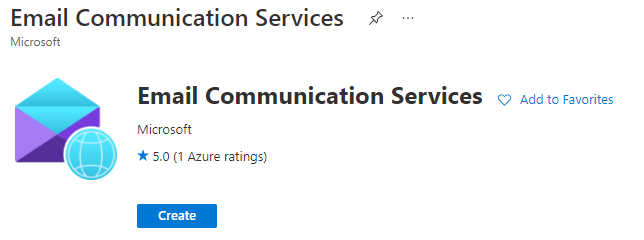

# Strapi Email provider for Azure Communication Service

## Installation

```bash
# using yarn
yarn add strapi-provider-email-azure

# using npm
npm install strapi-provider-email-azure --save
```

Then in your `config/plugins.js`:
```js
module.exports = ({ env }) => ({
  // ...
  email: {
    config: {
      provider: 'strapi-provider-email-azure',
      providerOptions: {
        endpoint: env('AZURE_ENDPOINT'),
      },
      settings: {
        defaultFrom: env('FALLBACK_EMAIL'),
      },
    },
  },
  // ...
});
```

## Usage

```js
await strapi
  .plugin('email')
  .service('email')
  .send({
    from: process.env.EMAIL_SERVICE_ADDRESS,
    to: [
      {
        address: 'recipent@email.address',
        displayName: 'Display Name',
      },
    ],
    subject: 'Hello world',
    text: 'Hello world',
  });
```
You can also leave the `from` field empty to send the email from the fallback address.

The following fields are supported:

| Field       | Description                                                       |
| ----------- | ----------------------------------------------------------------- |
| from        | Email address of the sender (string)                              |
| to          | Array of recipients (Array\<EmailAddress>)                        |
| replyTo     | Email address to which replies are sent (Array\<EmailAddress>)    |
| cc          | Array of recipients who get cc (Array\<EmailAddress>)             |
| bcc         | Array of recipients who get bcc (Array\<EmailAddress>)            |
| subject     | Subject of the email (string)                                     |
| text        | Plaintext version of the message (string)                         |
| html        | HTML version of the message (string)                              |
| attachments | Array of attachments (Array\<Attachment>)                         |
| disableUserEngagementTracking | Whether user engagement tracking should be disabled (boolean) |
| headers     | Custom email headers (Dictionary<string, string>)                 |

```ts
type EmailAddress {
    address: string,
    displayName: string
}
type EmailAddress {
    name: string,
    contentType: string,
    contentInBase64: string
}
```

For more information, please refer to @azure/communication-email documentations:
[npm](https://www.npmjs.com/package/@azure/communication-email)
[EmailMessage interface](https://learn.microsoft.com/en-us/javascript/api/@azure/communication-email/emailmessage?view=azure-node-latest#@azure-communication-email-emailmessage-content)

## How to create Azure Communication Service

### 1. Create the Email Communications Service
1. Navigate to the [Azure portal](https://portal.azure.com/) to create a new resource
2. Create **Email Communication Services**

3. Complete the required information on the basics tab
4. Review the resource details. Click Create
5. Wait for the Deployment to complete

### 2. Create Communication Service
1. Navigate to the [Azure portal](https://portal.azure.com/) to create a new resource
2. Create **Communication Services**

3. Complete the required information on the basics tab
4. Review the resource details. Click Create
5. Wait for the Deployment to complete

### 3. Connect the services
1. Go to your newly created **Email Communcation Services** resource, and navigate to **Provision Domains**

2. Add a new Azure managed domain or Custom domain

3. Go to your **Communication Services** resource, and navigate to **Email/Domains**

4. Connect to the domain you created in you Email Communication Services resource


### 4. Acquire access endpoint key
1. In your **Communication Services** resource, navigate to **Settings/Keys**
2. Copy your **Primary key/Connection string**

3. Store it in your environment variables\
`AZURE_ENDPOINT=<connection_string>`

### 5. (Optional) Create email addresses
1. In your **Email Communication Services** resource, go to **Provision Domains**, and click on the name of your domain
2. In **Email services/MailFrom addresses** you can create additional email addresses
3. By default DoNotReply@yourdomain is created, and you can store it as the fallback email address of `strapi-provider-email-azure` in your environment variables\
`FALLBACK_EMAIL=DoNotReply@yourdomain`